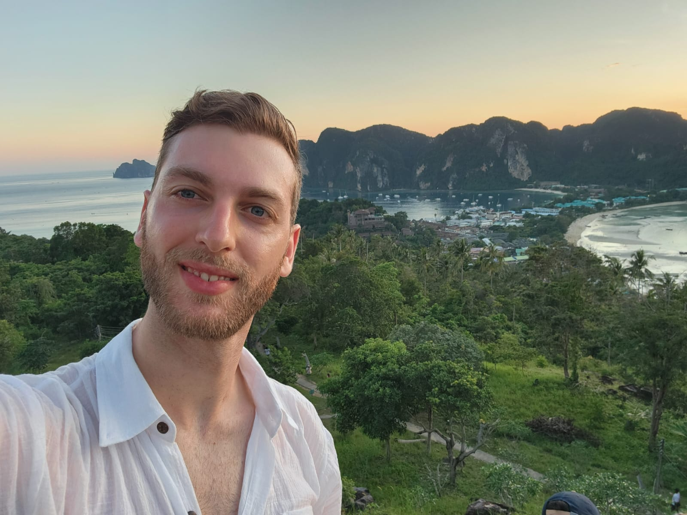

# Rotem Berda's Web Page

## About Me
I am passionate about **applied biology** and have a strong academic foundation in the field. I graduated with a BSc from **Hebrew University of Jerusalem (HUJI)** and am currently pursuing my MSc. at **Prof. Naama Barkai's Lab**. I specialize in understanding biological systems through advanced experimental and computational approaches.

You can learn more about the lab I work in here:  
[Prof. Naama Barkai's Lab](https://barkailab.wixsite.com/barkai)

### Background
I have hands-on experience in:
- **Human cell culture**  
- **Cloning**  
- **RNA sequencing (RNA-seq)**  
- **Data analysis**  

My research combines both wet-lab techniques and bioinformatics to tackle questions in applied biology.

### Contact
Feel free to reach out to me through my GitHub profile.
[GitHub: @rotemberda](https://github.com/rotemberda)

---

If you would like to connect or collaborate, please don't hesitate to reach out!
