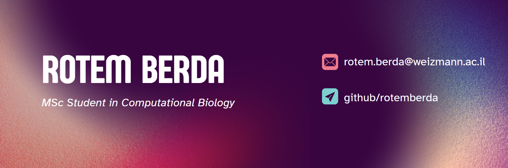

  

  
  

    <h2 style="color: #2C3E50;">Hello! I'm Rotem, a Researcher in Applied Biology</h2>
    
Currently, I am pursuing my MSc at the Weizmann Institute of Science, exploring biological systems with advanced experimental and computational methods.

  

---

## About Me
I am passionate about **applied biology** and have a strong academic foundation in the field. I graduated with a BSc from **Hebrew University of Jerusalem (HUJI)**, where I worked in [Prof. Dror Sharon's lab](https://drorsharon1.wixsite.com/the-sharon-lab), and I am currently pursuing my MSc at **Prof. Naama Barkai's Lab**. My research focuses on understanding biological systems through advanced experimental and computational approaches.

### Background
I have hands-on experience in:
- **Human cell culture**  
- **Cloning**  
- **RNA sequencing (RNA-seq)**  
- **Data analysis**  

My research combines wet-lab techniques and bioinformatics to tackle questions in applied biology.

You can learn more about the lab I work in here:  
[Prof. Naama Barkai's Lab](https://barkailab.wixsite.com/barkai) | [Weizmann Institute of Science](https://www.weizmann.ac.il/pages/)

---

## Projects
Check out some of my recent work on [GitHub](https://github.com/rotemberda).

---

## Links
You can find links to the WIS Python course repository and Gabor's homepage here:
- [WIS Python Course Repository](https://github.com/szabgab/wis-python-course-2024-11)  
- [Gabor's Homepage](https://szabgab.com/)

---

## Contact
If you'd like to connect or collaborate, please don’t hesitate to reach out via [GitHub](https://github.com/rotemberda).

---

